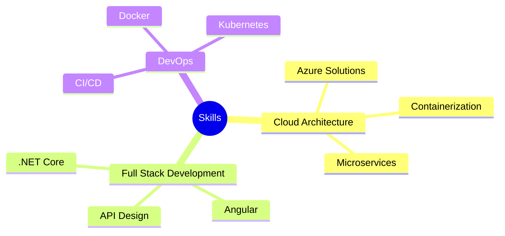

<div align="center">
  
</div>

<div align="center">
  
[](https://git.io/typing-svg)

<p align="center">
  <a href="mailto:mohamedumairinfo@gmail.com"></a>
  <a href="https://linkedin.com/in/umair-mohamed"></a>
  <a href="https://instagram.com/umi_irsh"></a>
  <a href="https://holopin.io/@umiloop"></a>
</p>

<p align="center">
  
  
  
</p>

</div>

## 🚀 About Me

> *"Crafting elegant solutions to complex problems"*


- 🎯 Currently crafting enterprise solutions at **Virtusa**
- 💡 Specializing in **.NET Core**, **Angular**, and **Azure** cloud architecture
- 🌱 Building scalable microservices and cloud-native applications
- 🔭 Exploring **DevOps**, **Kubernetes**, and **Software Architecture**
- 🌏 Based in Sri Lanka, collaborating globally
- ⚡ Fun fact: I love exploring new technologies and building side projects

<br>

## 🛠️ Technology Arsenal

<details>
<summary>Click to expand!</summary>

### 🔵 Primary Stack
```javascript
{
  "languages": ["C#", "TypeScript", "JavaScript"],
  "backend": [".NET Core", "ASP.NET Web API", "Entity Framework"],
  "frontend": ["Angular", "RxJS", "Material Design"],
  "cloud": ["Azure", "Docker", "Kubernetes"],
  "databases": ["SQL Server", "MongoDB", "Redis"]
}
```

### 🎯 Expertise

<div align="center">

#### Languages & Frameworks


#### Cloud & DevOps


#### Databases & Tools


</div>
</details>

## 📊 GitHub Analytics

<div align="center">
  
  
</div>

<div align="center">
  
</div>

## 🏆 GitHub Trophies

<div align="center">
  


</div>

## 📌 Featured Projects

<div align="center">

[](https://github.com/umiloop/your-best-repo)

</div>

## 🎯 Current Focus



<div align="center">
  
</div>

<div align="center">
  
[](https://git.io/typing-svg)

</div>
